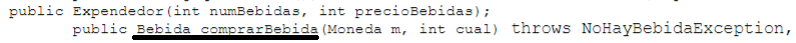

# Tarea 2 de Programación 2 (2022-2)

### Equipo
* Alonso Bustos
* Cristobal Figueroa
## Dudas
- Preguntar sobre porque en los prototipos de metodos y clases, la bebida se compra llamando a bebida y no a expendedor!!

[
