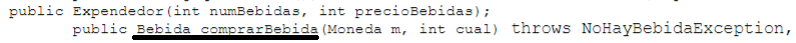
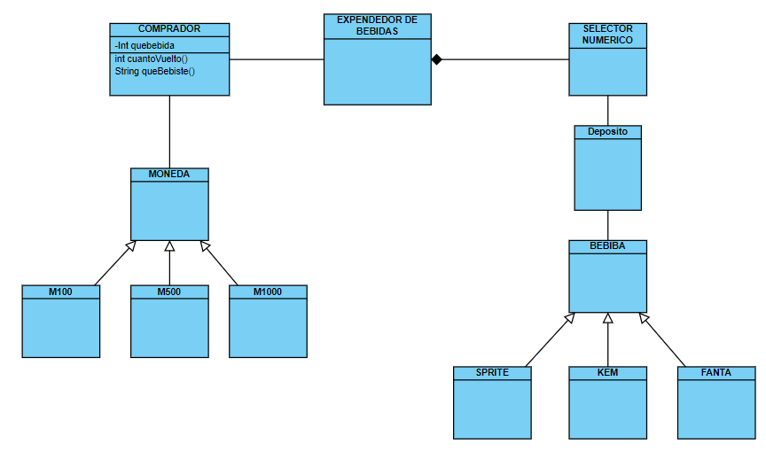

# Tarea 2 de Programación 2 (2022-2)
### Equipo
* Alonso Bustos (Ado-do)
* Cristobal Figueroa (xKroZzar)
## FECHA LIMITE !!!! :eyes: :eyes:
   27-10
## Objetivos
- [ ] Crear UMLs y compararlos.
- [ ] Empezar a crear el programa.
- [ ] ... :construction: :construction:
## Dudas
- Preguntar sobre porque en los prototipos de metodos y clases, la bebida se compra llamando a bebida y no a expendedor!!

## Ideas UML
- Idea de xKroZzar

