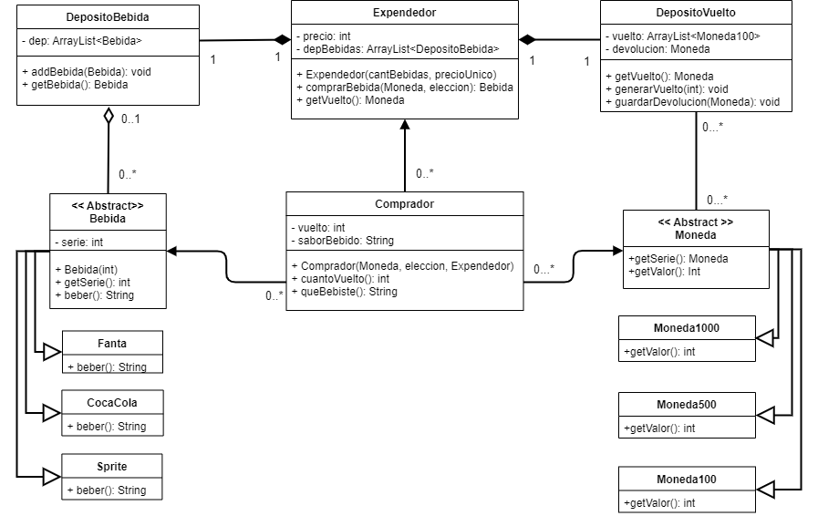

# Tarea 2 de Programación 2 (2022-2)
### Equipo
* Alonso Bustos (Ado-do)
* Cristobal Figueroa (xKroZzar)

## FECHA LIMITE !!!! :eyes: :eyes:
~~Jueves 27 de Octubre (27/10/2022)~~
-> Domingo 30 de Octubre (30/10/2022)

## Objetivos
- [X] ~~Escribir y testear codigo.~~
- [X] ~~Crear UML en base al codigo.~~

## UML

